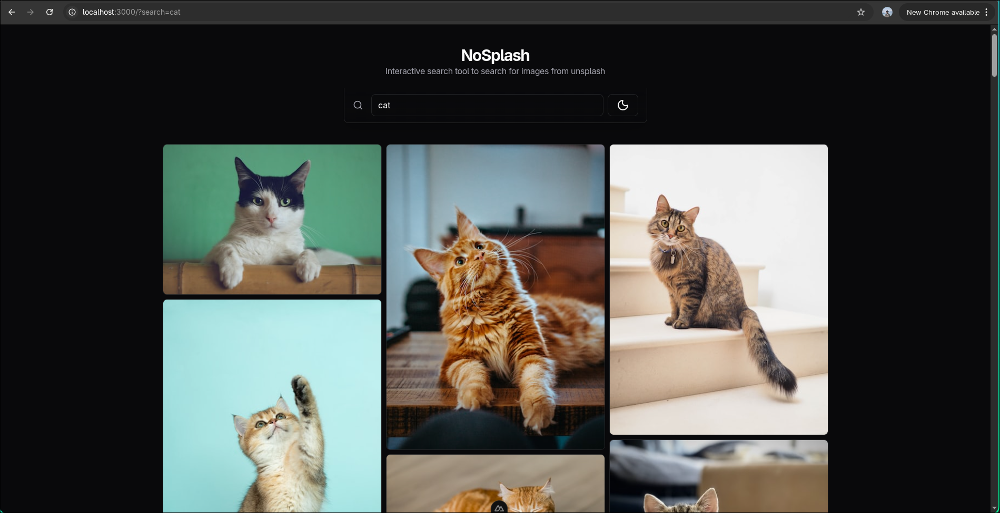
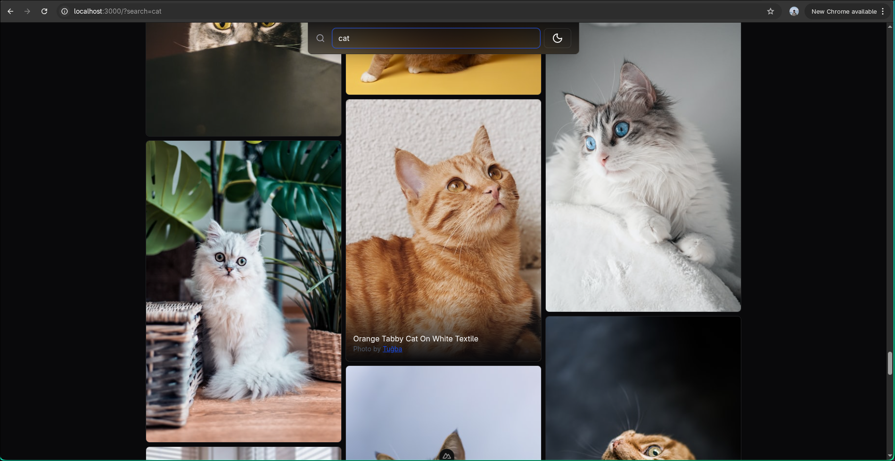
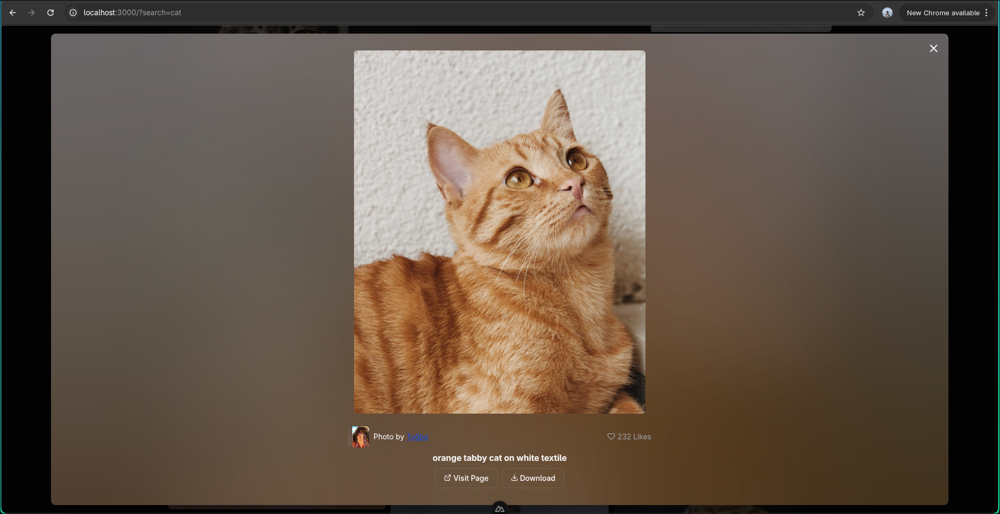

# NoSplash

A minimalistic, fast, responsive image search tool.

## [Live link](https://unsplash-minimal-search-gallery.vercel.app/)

## Tech Stack

- Nuxt 4.2.2
- Vue 3.5
- Tailwind 4.1
- Unsplash API

## Running locally

- Pre-requisites:
  - Unsplash access key and secret key. Get them [here](https://unsplash.com/developers)
  - Node 20.x or newer ([nuxt requirement](https://nuxt.com/docs/4.x/getting-started/installation#prerequisites))
  - [pnpm](https://pnpm.io/)
- Steps:
  1. Clone the repo - `git clone https://github.com/adityanandanx/unsplash-minimal-search-gallery && cd unsplash-minimal-search-gallery`
  2. Setup environment variables - `cp .env.example .env` and then copy paste your unsplash secrets in the `.env` file
  3. Install dependencies - `pnpm install`
  4. Run the dev server - `pnpm dev`
  5. Open [http://localhost:3000](http://localhost:3000) on your browser

## Goals

- Making sure `access_key` and `secret_key` remain confidential as stated on the unsplash api docs
- Caching mechanism to improve UX and be within the 50 req/hour limit of the unsplash api
- Image optimization - load small images first then lazily load the larger ones
- Debounced input for search query
- Masonry layout for the gallery
- Infinite scrolling
- Fluid, interactive and polished UI/UX

## Approach

- I chose Nuxt because I a proxy server is required to send requests to the unsplash api in order to keep my secret keys confidential.
- This decision also helped in terms of caching because Nuxt provides `useFetch` composable along with `$fetch` which automatically handles caching responses.
- Nuxt also provides NuxtImg which handles placeholder images, which are displayed till the actual image is finally loaded.
- Debouncing algorithm is fairly simple - keep clearing the timeout every time the callback is called and set a new timeout for the delay specified.
- The biggest challenge was the masonry layout.
  - I found 2 approaches - approach 1 uses a simple [columns layout](https://developer.mozilla.org/en-US/docs/Web/CSS/Reference/Properties/columns) and approach 2 is what I implemented
  - Columns layout is fairly simple but the drawback is that the elements are not filled from left to right, top to bottom. Which makes this approach useless as there would be layout shifts everywhere when new images are loaded. This is why I had to go for a more complex, approach 2 -
  - Approach 2 has a grouping mechanism which converts a 1d images array to 2d array based on the user’s screen. On desktops - Nx3, on tablets - Nx2, and on phones - Nx1. Then a flex layout is rendered based on this matrix.
- Infinite scrolling was another issue which took me a lot of time.
  - The simple approach is to create a single sentinel element at the bottom of the masonry layout, which when enters the viewport triggers the next page fetch.  
    But due to the fact that each column has varying height, a gap would be clearly visible before the next page fetch happens - which would hurt UX.
  - The solution is to use n number of sentinel elements where n is the number of columns of the masonry layout and each sentinel is placed at the bottom of the column. This results in fluid infinite scrolling without any gaps.
- Things which I did to improve the UI/UX
  - Images staggered appear and disappear animations using [Vue TransitionGroup api](https://vuejs.org/guide/built-ins/transition-group.html)
  - Modal/Dialog appear and disappear transitions using [Vue Transition api](https://vuejs.org/guide/built-ins/transition)
  - Render placeholder smaller sized images which load fast to give the user a preview of the image and replace it with the original image once it is loaded
  - Draw blur hash canvas using the [blurhash library](https://www.npmjs.com/package/blurhash) for the subtle blurry, glassy look in the modal background
  - `Ctrl+k` or `Cmd+k` to focus the search bar.
  - Loading skeletons and spinners for visual feedback of pending states
  - The query state is saved in the url bar which makes it refreshable

## Scalability

- The server proxy pattern in `server/api/unsplash/photos.ts` can be easily extended to incorporate other image APIs (Pexels, Pixabay) by adding new api routes.
- unit, component, or end-to-end tests can be added to make sure nothing breaks in the future
- The infinite scroll can be made faster by using virtual scrolling to handle thousands of images without DOM bloat.
- The current grouping algorithm can be improved to be more performant
